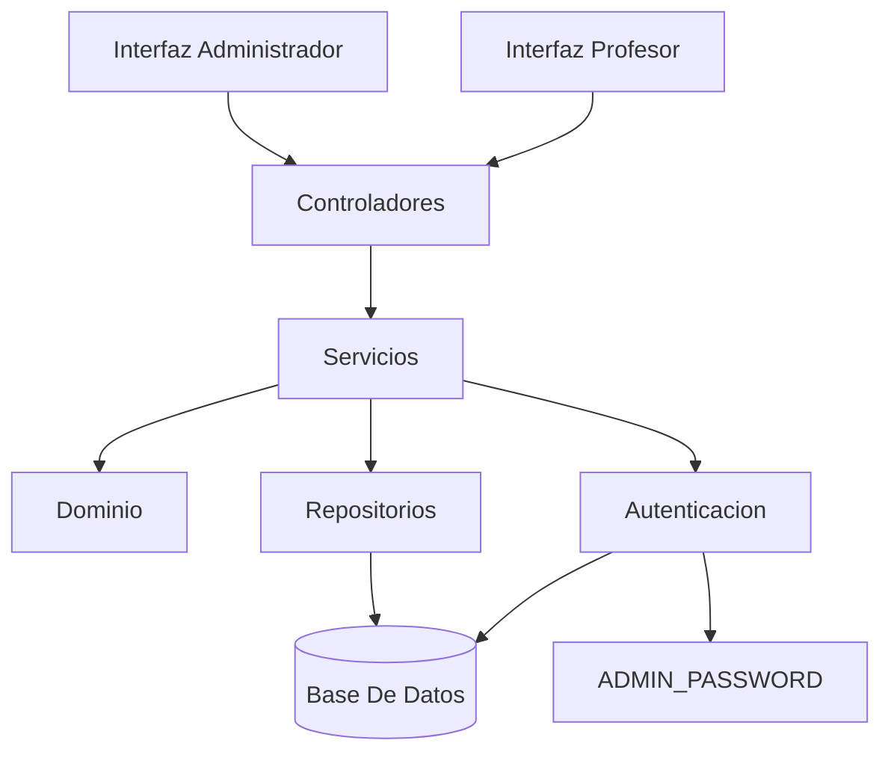

# Arquitectura

## Objetivo

Definir una unica arquitectura de referencia para el sistema de asistencia, en un nivel suficiente para guiar la implementacion sin duplicar contenido.

## Stack Sugerido

- backend: `Node.js` + `Express`;
- frontend: interfaz web simple para administrador y profesor;
- base de datos: `PostgreSQL` sobre `Neon`;
- despliegue del backend y APIs: `Render`;
- configuracion: archivo `.env`;
- acceso a datos: repositorios con SQL directo.

## Vista General



## Capas

- `Presentacion`: muestra pantallas y recibe formularios.
- `Controladores`: traducen requests y delegan en servicios.
- `Servicios`: implementan casos de uso y validan permisos.
- `Dominio`: concentra reglas de negocio.
- `Persistencia`: encapsula consultas y transacciones.

## Modulos

- `Autenticacion`: login unificado para administrador y profesor, con validacion prioritaria de admin y bloqueo de profesores inhabilitados.
- `Alumnos`: alta, edicion y busqueda; el profesor puede crear y editar alumnos desde su pantalla segun la sala.
- `Salas`: alta, horario y asignacion de uno o mas profesores.
- `Asistencia`: crear toma, registrar presentes, consultar historial y corregir por administrador.
- `Profesores`: listado, cambio de clave, habilitacion e inhabilitacion.

## Reglas Centrales

- un alumno puede ser registrado por un profesor y quedar asociado a la sala desde la que se lo crea;
- el profesor puede editar alumnos de sus salas segun reglas de aplicacion;
- una sala puede tener uno o mas profesores asignados;
- solo existe una toma por sala y fecha;
- la toma la crea uno de los profesores asignados a la sala;
- la toma debe realizarse dentro del horario de la sala;
- el profesor puede modificar una toma solo durante el mismo dia;
- despues de esa fecha, solo el administrador puede modificarla;
- un profesor inhabilitado no puede iniciar sesion ni operar.

## Estructura Sugerida

```text
src/
  controllers/
  services/
  domain/
  repositories/
  middleware/
  db/
  views/
  config/
```

## Endpoints Base

- `POST /login`
- `GET /alumnos`
- `POST /alumnos`
- `GET /salas`
- `POST /salas`
- `POST /asistencias`
- `GET /asistencias/historial`
- `POST /profesores/:id/cambiar-clave`
- `POST /profesores/:id/habilitacion`

## Persistencia Esperada

- `profesor`
- `credencial_profesor`
- `sala`
- `sala_profesor`
- `alumno`
- `toma_asistencia`
- `detalle_asistencia`

## Infraestructura

- el backend se despliega en `Render`;
- la base de datos PostgreSQL se aloja en `Neon`;
- la aplicacion se conecta mediante `DATABASE_URL` y otras variables de entorno;
- `schema.sql` se aplica sobre la base de datos de `Neon`.

## Decisiones Relevantes

- la autenticacion de administrador y profesores se mantiene separada;
- las validaciones criticas quedan del lado del servidor;
- la tabla `sala_profesor` resuelve la asignacion multiple de profesores por sala;
- la arquitectura prioriza simplicidad y deja abierta una evolucion futura hacia auditoria o una API mas formal.
