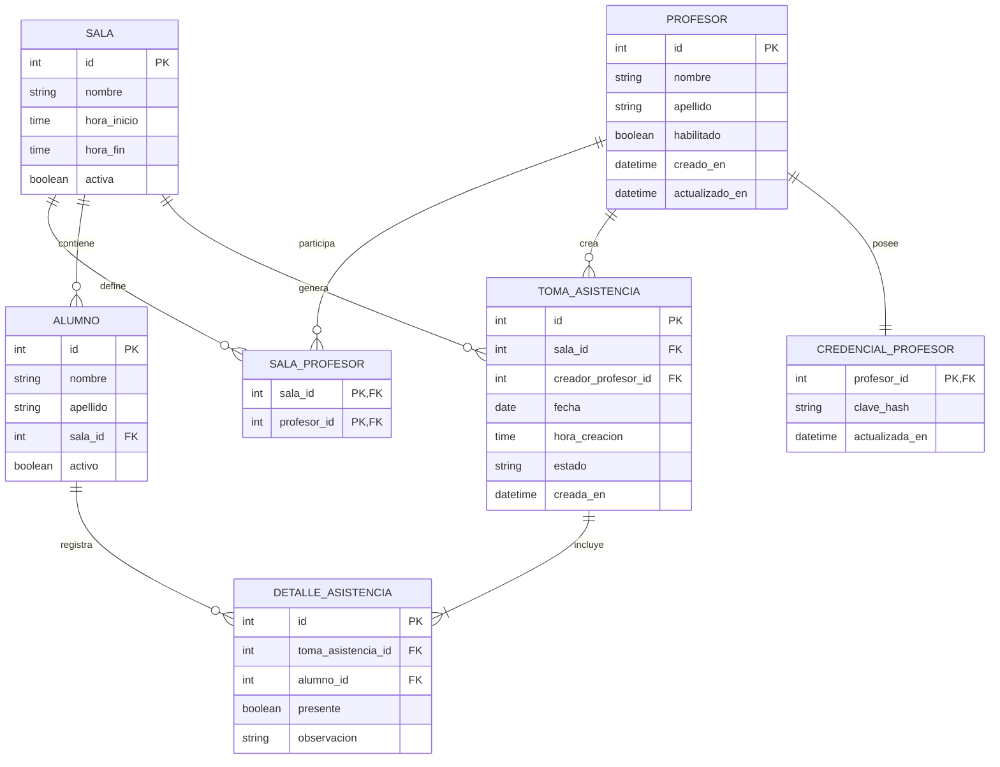

# Diseno De Base De Datos Logica

## Objetivo

Traducir el modelo conceptual del sistema a una estructura logica persistible en una base de datos relacional.

## Criterios Generales

- Se propone una base de datos relacional.
- El administrador no requiere tabla propia en la primera etapa, porque su autenticacion depende de configuracion externa.
- Las claves de profesores se almacenan protegidas.
- Los alumnos pueden darse de alta desde la pantalla del profesor y quedan asociados a una sala al momento de su registro.
- La ausencia se puede deducir por complemento, pero para simplificar consultas y correcciones conviene persistir el detalle de asistencia por alumno.

## Diagrama Entidad Relacion

## Tablas

### PROFESOR

| Campo | Tipo | Restricciones |
| --- | --- | --- |
| id | entero | PK |
| nombre | texto | not null |
| apellido | texto | not null |
| habilitado | booleano | not null, default true |
| creado_en | datetime | not null |
| actualizado_en | datetime | not null |

### CREDENCIAL_PROFESOR

| Campo | Tipo | Restricciones |
| --- | --- | --- |
| profesor_id | entero | PK, FK -> PROFESOR.id |
| clave_hash | texto | not null |
| actualizada_en | datetime | not null |

### SALA

| Campo | Tipo | Restricciones |
| --- | --- | --- |
| id | entero | PK |
| nombre | texto | not null, unique si se desea evitar duplicados |
| hora_inicio | time | not null |
| hora_fin | time | not null |
| activa | booleano | not null, default true |

### SALA_PROFESOR

| Campo | Tipo | Restricciones |
| --- | --- | --- |
| sala_id | entero | PK, FK -> SALA.id |
| profesor_id | entero | PK, FK -> PROFESOR.id |

### ALUMNO

| Campo | Tipo | Restricciones |
| --- | --- | --- |
| id | entero | PK |
| nombre | texto | not null |
| apellido | texto | not null |
| sala_id | entero | FK -> SALA.id, not null |
| activo | booleano | not null, default true |

### TOMA_ASISTENCIA

| Campo | Tipo | Restricciones |
| --- | --- | --- |
| id | entero | PK |
| sala_id | entero | FK -> SALA.id, not null |
| creador_profesor_id | entero | FK -> PROFESOR.id, not null |
| fecha | date | not null |
| hora_creacion | time | not null |
| estado | texto | not null |
| creada_en | datetime | not null |

Restriccion recomendada:

- unique (`sala_id`, `fecha`)

### DETALLE_ASISTENCIA

| Campo | Tipo | Restricciones |
| --- | --- | --- |
| id | entero | PK |
| toma_asistencia_id | entero | FK -> TOMA_ASISTENCIA.id, not null |
| alumno_id | entero | FK -> ALUMNO.id, not null |
| presente | booleano | not null |
| observacion | texto | nullable |

Restriccion recomendada:

- unique (`toma_asistencia_id`, `alumno_id`)

## Reglas Que Debe Soportar La Base

- Un alumno solo puede estar asociado a una sala a la vez.
- Una sala puede tener uno o mas profesores asociados.
- No puede existir mas de una toma por sala y fecha.
- Una credencial pertenece a un unico profesor.
- El detalle no debe repetir un mismo alumno dentro de la misma toma.

## Indices Recomendados

- indice por `ALUMNO(apellido, nombre)`
- indice por `SALA_PROFESOR(profesor_id)`
- indice por `TOMA_ASISTENCIA(sala_id, fecha)`
- indice por `DETALLE_ASISTENCIA(alumno_id)`

## Evolucion Futura

- Agregar tabla de auditoria para cambios de asistencia.
- Agregar tabla de sesiones o usuarios si el administrador pasa a autenticarse formalmente.
- Agregar vigencia temporal en `SALA_PROFESOR` si se necesita trazabilidad historica de asignaciones.
