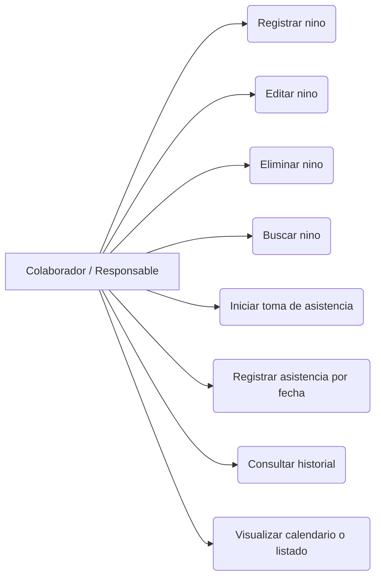
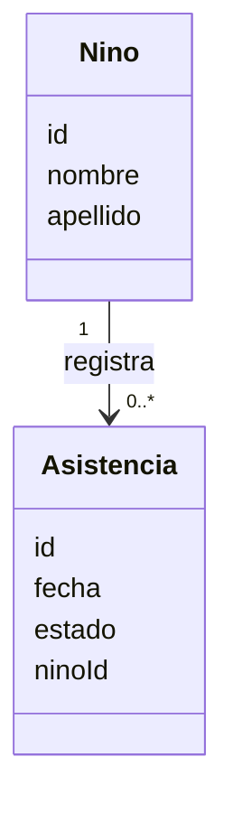

# Analisis De Software Simplificado

## 1. Vision Y Alcance

### 1.1 Contexto
El Centro de Gestion Comunitaria realiza actividades de apoyo escolar para ninos y actualmente no cuenta con una herramienta digital organizada para registrar asistencia y mantener una base de datos basica de participantes.

Segun el documento fuente, hoy la informacion puede quedar dispersa, incompleta o depender de registros en papel, mensajes o anotaciones individuales. Esto dificulta:

- Consultar rapidamente que ninos asistieron.
- Saber en que fechas participaron.
- Mantener informacion actualizada.
- Hacer seguimiento ordenado de la participacion.
- Planificar actividades en base a datos concretos.

### 1.2 Problema A Resolver
Se necesita una solucion simple y accesible para registrar ninos, tomar asistencia por fecha y consultar el historial de participacion sin depender de registros manuales o poco sistematizados.

### 1.3 Objetivo General
Desarrollar un sistema que permita registrar ninos, tomar asistencia diaria y consultar el historial de participacion en un calendario o registro ordenado por fechas.

### 1.4 Alcance Funcional Declarado
El documento fuente define que el sistema incluira:

- Registro de ninos.
- Edicion y eliminacion de datos.
- Toma de asistencia manual.
- Consulta de asistencia por fecha.
- Visualizacion basica mediante calendario o listado.
- Base de datos con informacion de ninos y asistencias.

### 1.5 Fuera De Alcance
El documento fuente explicita que en esta primera etapa no se incluira:

- Envio automatico de mensajes a familias.
- Control de usuarios avanzado.
- Reportes estadisticos complejos.
- Integracion con sistemas externos.
- Aplicacion movil nativa.
- Carga masiva desde Excel.

## 2. Para Quien Se Construye

### 2.1 Usuarios Principales
- Responsables del Centro de Gestion Comunitaria.
- Colaboradores del espacio que registran informacion y asistencia.

### 2.2 Beneficiarios Indirectos
- Ninos que asisten a clases de apoyo, ya que un mejor seguimiento permitiria detectar ausencias frecuentes y mejorar el acompanamiento.

### 2.3 Necesidades De Los Usuarios
- Registrar rapidamente datos basicos de cada nino.
- Marcar presencia o ausencia en una fecha determinada.
- Consultar asistencias anteriores sin revisar papeles o mensajes.
- Buscar rapidamente un nino por nombre o apellido.
- Operar con una interfaz simple y clara, apta para personas sin conocimientos tecnicos avanzados.

## 3. Requerimientos

### 3.1 Requerimientos Funcionales
1. El sistema debe permitir crear, modificar y eliminar registros de ninos con los datos nombre y apellido.
2. El sistema debe mostrar la opcion para comenzar la toma de asistencia.
3. El sistema debe mostrar la lista de ninos cargados para marcar presentes o ausentes en una fecha especifica.
4. El sistema debe permitir consultar asistencias anteriores.
5. El sistema debe permitir buscar rapidamente a un nino por nombre o apellido.

### 3.2 Requerimientos No Funcionales
1. La interfaz debe ser simple, clara e intuitiva.
2. La carga de asistencia debe poder realizarse de manera rapida.
3. El sistema debe funcionar correctamente desde una computadora o celular.
4. Los datos deben almacenarse de forma segura.
5. El sistema debe tener tiempos de respuesta bajos.
6. El diseno debe ser liviano y facil de mantener.
7. El sistema debe permitir futuras mejoras sin rehacer toda la estructura.

## 4. Reglas De Negocio

Las siguientes reglas se desprenden del documento fuente y de los requerimientos explicitados:

1. Cada nino debe poder registrarse con al menos nombre y apellido.
2. La asistencia se registra manualmente por fecha.
3. Para tomar asistencia debe existir previamente una lista de ninos cargados.
4. En una fecha determinada, cada nino debe poder marcarse como presente o ausente.
5. Las asistencias historicas deben poder consultarse luego de ser registradas.
6. La busqueda de un nino debe realizarse por nombre o apellido.
7. El sistema se enfoca solo en funciones esenciales de registro y consulta.
8. No forman parte de la primera etapa las funciones de mensajeria, estadisticas avanzadas, integraciones externas ni carga masiva.

### 4.1 Reglas No Definidas En La Fuente
El documento fuente no define explicitamente:

- Si un nino puede tener mas datos obligatorios ademas de nombre y apellido.
- Si se permite registrar multiples asistencias del mismo nino en la misma fecha.
- Si existira control de permisos basico o acceso libre.
- Si la ausencia admite categorias adicionales.
- Si la visualizacion prioritaria sera calendario, listado o ambas en la primera version.

Estas definiciones deberian validarse con los responsables del centro antes de considerar cerrado el analisis.

## 5. Casos De Uso

### 5.1 Lista De Casos De Uso
- CU01. Registrar nino.
- CU02. Editar datos de nino.
- CU03. Eliminar nino.
- CU04. Buscar nino.
- CU05. Iniciar toma de asistencia.
- CU06. Registrar asistencia por fecha.
- CU07. Consultar historial de asistencia.
- CU08. Visualizar asistencias por fecha en calendario o listado.

### 5.2 Descripcion Resumida

**CU01. Registrar nino**
- Actor principal: Colaborador o responsable.
- Objetivo: Dar de alta un nino con datos basicos.
- Entradas: Nombre, apellido.
- Resultado esperado: El nino queda disponible para futuras tomas de asistencia.

**CU02. Editar datos de nino**
- Actor principal: Colaborador o responsable.
- Objetivo: Corregir o actualizar datos basicos del nino.
- Resultado esperado: La informacion queda actualizada.

**CU03. Eliminar nino**
- Actor principal: Colaborador o responsable.
- Objetivo: Quitar un registro que ya no corresponda mantener.
- Resultado esperado: El nino deja de aparecer en listados operativos.

**CU04. Buscar nino**
- Actor principal: Colaborador o responsable.
- Objetivo: Encontrar rapidamente un registro por nombre o apellido.
- Resultado esperado: El sistema muestra el nino buscado o coincidencias.

**CU05. Iniciar toma de asistencia**
- Actor principal: Colaborador o responsable.
- Objetivo: Acceder a la funcionalidad de asistencia para una fecha determinada.
- Resultado esperado: El sistema muestra el listado de ninos para marcar asistencia.

**CU06. Registrar asistencia por fecha**
- Actor principal: Colaborador o responsable.
- Objetivo: Marcar presente o ausente a cada nino en una fecha especifica.
- Resultado esperado: La asistencia queda almacenada y disponible para consulta.

**CU07. Consultar historial de asistencia**
- Actor principal: Colaborador o responsable.
- Objetivo: Revisar asistencias anteriores.
- Resultado esperado: El sistema devuelve el historial registrado.

**CU08. Visualizar asistencias por fecha en calendario o listado**
- Actor principal: Colaborador o responsable.
- Objetivo: Ver asistencias cargadas por dia en un formato ordenado.
- Resultado esperado: La informacion se presenta de manera clara para seguimiento.

## 6. Actores Del Sistema

### 6.1 Actor Primario
**Colaborador/Responsable Del Centro**
- Registra ninos.
- Edita o elimina datos.
- Toma asistencia.
- Busca participantes.
- Consulta historial.

### 6.2 Actor Secundario
**Nino Participante**
- No interactua directamente con el sistema segun la fuente.
- Es la entidad sobre la cual se registran datos y asistencia.

## 7. Modelo De Dominio

### 7.1 Entidades Principales

**Nino**
- Identificador.
- Nombre.
- Apellido.

**Asistencia**
- Identificador.
- Fecha.
- Estado de asistencia: presente o ausente.
- Referencia al nino.

### 7.2 Relaciones
- Un nino puede tener muchas asistencias registradas.
- Cada asistencia corresponde a un solo nino.
- Cada asistencia se registra para una fecha determinada.

## 8. Diagramas UML De Analisis

### 8.1 Diagrama De Casos De Uso


### 8.2 Diagrama De Dominio


## 9. Prototipos O Wireframes

No hay prototipos detallados en el documento fuente, pero si hay una definicion clara de las pantallas minimas necesarias para cubrir el alcance declarado.

### 9.1 Pantallas Minimas Derivadas Del Analisis

**Pantalla 1. Lista de ninos**
- Buscador por nombre o apellido.
- Boton para registrar nino.
- Acciones para editar y eliminar.

**Pantalla 2. Formulario de nino**
- Campo nombre.
- Campo apellido.
- Accion guardar.

**Pantalla 3. Toma de asistencia**
- Selector o visualizacion de fecha.
- Lista de ninos cargados.
- Marcacion presente/ausente.
- Accion guardar asistencia.

**Pantalla 4. Consulta de historial**
- Filtro por fecha o acceso a listado/calendario.
- Visualizacion de asistencias ya registradas.

### 9.2 Boceto Textual Simplificado
```text
Inicio
|-- Ninos
|   |-- Buscar
|   |-- Nuevo nino
|   |-- Editar
|   |-- Eliminar
|
|-- Asistencia
|   |-- Seleccionar fecha
|   |-- Marcar presentes/ausentes
|   |-- Guardar
|
|-- Historial
    |-- Ver por fecha
    |-- Ver en listado o calendario
```

## 10. Glosario

- **Centro de Gestion Comunitaria**: Institucion donde se realizan las clases de apoyo escolar.
- **Nino**: Participante registrado para seguimiento de asistencia.
- **Asistencia**: Registro de presencia o ausencia de un nino en una fecha.
- **Historial de asistencia**: Consulta de asistencias ya cargadas.
- **Toma de asistencia**: Proceso manual de marcar presente o ausente.
- **Listado**: Vista ordenada por fechas o por registros.
- **Calendario**: Vista temporal para consultar participacion por dia.

## 11. Matriz De Trazabilidad

| Necesidad detectada | Requerimiento | Caso de uso | Regla/alcance relacionado |
| --- | --- | --- | --- |
| Evitar registros dispersos en papel o mensajes | RF01 Crear, modificar y eliminar ninos | CU01, CU02, CU03 | Registro basico de participantes |
| Tomar asistencia de forma ordenada | RF02 Iniciar toma de asistencia | CU05 | La asistencia se registra por fecha |
| Marcar presentes o ausentes | RF03 Marcar asistencia por fecha | CU06 | Cada nino puede marcarse presente o ausente |
| Consultar asistencias anteriores | RF04 Consultar asistencias | CU07, CU08 | Debe existir historial consultable |
| Encontrar rapidamente a un nino | RF05 Buscar por nombre o apellido | CU04 | Busqueda por nombre o apellido |
| Usabilidad para personal no tecnico | RNF01 Interfaz simple e intuitiva | Todos | Solucion simple y accesible |
| Operacion agil | RNF02 Carga rapida | CU05, CU06 | Toma de asistencia rapida |
| Uso en computadora o celular | RNF03 Compatibilidad multidispositivo | Todos | Accesibilidad operativa |
| Cuidado de informacion | RNF04 Almacenamiento seguro | Todos | Datos almacenados de forma segura |
| Evolucion futura | RNF06 y RNF07 | Todos | Facil mantenimiento y mejora incremental |

## 12. Limites, Riesgos Y Restricciones

### 12.1 Limites Confirmados
- El analisis cubre una primera etapa de funcionalidad minima.
- El foco esta en registro de ninos y asistencias.
- No se incluyen funcionalidades administrativas avanzadas.

### 12.2 Riesgos Detectados
- Falta de definiciones operativas mas finas sobre validaciones de datos.
- Posible ambiguedad sobre como evitar duplicados de asistencia por fecha.
- No se detallan criterios explicitos de seguridad ni respaldo.
- No se define si el calendario y el listado son obligatorios ambos o si uno puede reemplazar al otro.

### 12.3 Restricciones Del Contexto
- La herramienta debe ser simple para usuarios no tecnicos.
- Debe reducir tareas administrativas simples.
- Debe priorizar rapidez de carga y consulta.

## 13. Como Validar Que Realmente Sirve

### 13.1 Criterios De Aceptacion Del Analisis
El sistema analizado sera adecuado si permite comprobar que:

1. Un colaborador puede registrar un nino solo con nombre y apellido.
2. Un colaborador puede buscar un nino rapidamente por nombre o apellido.
3. Un colaborador puede iniciar una toma de asistencia para una fecha.
4. Un colaborador puede marcar presentes y ausentes y guardar el resultado.
5. Un colaborador puede consultar asistencias anteriores por fecha.
6. La operacion puede realizarse desde computadora o celular.
7. La interfaz resulta comprensible para personas sin perfil tecnico avanzado.

### 13.2 Estrategia De Validacion Recomendada
- Validacion con responsables y colaboradores del centro mediante revision del analisis.
- Prueba guiada de tareas basicas: alta de nino, toma de asistencia, consulta de historial y busqueda.
- Confirmacion de que las funciones fuera de alcance siguen efectivamente excluidas de la primera etapa.
- Revision de puntos abiertos antes de pasar a especificacion detallada o desarrollo.

### 13.3 Preguntas Pendientes Para Cierre Definitivo Del Analisis
- Se necesitan mas datos del nino ademas de nombre y apellido.
- Debe permitirse una sola asistencia por nino por fecha.
- Se requiere algun nivel de acceso o identificacion de usuario.
- La consulta historica debe ser obligatoriamente en calendario, en listado o en ambos formatos.
- Se necesita conservar registros eliminados o la eliminacion puede ser definitiva.

## 14. Conclusion

El problema de negocio esta claramente identificado: el centro necesita ordenar y simplificar el registro de asistencia y la consulta historica de participacion de ninos en clases de apoyo. El alcance de la primera etapa tambien esta bien delimitado y prioriza funciones esenciales, simplicidad de uso y bajo nivel de complejidad operativa.

Desde el punto de vista del analisis de software, el proyecto tiene una base suficiente para continuar, aunque todavia requiere cerrar algunas definiciones operativas para evitar ambiguedades durante etapas posteriores. El mayor valor del sistema propuesto no esta en agregar muchas funciones, sino en resolver de manera clara, rapida y usable una necesidad concreta del contexto comunitario.
