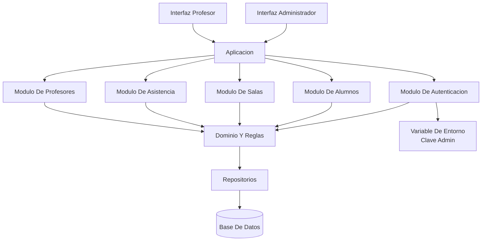

# Arquitectura De Modulos Y Capas

## Objetivo

Definir una arquitectura simple, coherente con el alcance actual del sistema y suficiente para una primera implementacion.

## Diagrama General

## Capas

### 1. Presentacion

- Pantallas de administrador.
- Pantallas de profesor.
- Formularios de alumnos, salas, profesores y asistencia.

### 2. Aplicacion

- Orquesta casos de uso.
- Valida permisos segun rol.
- Coordina lecturas y escrituras sobre repositorios.

### 3. Dominio

- Contiene entidades, reglas de negocio y validaciones centrales.
- Hace cumplir unicidad de toma por sala y fecha.
- Restringe la toma al profesor asignado y al horario valido.

### 4. Infraestructura

- Persistencia en base de datos.
- Lectura de variable de entorno para clave de administrador.
- Cifrado o hash de claves de profesores.

## Modulos Funcionales

### Modulo De Autenticacion

- valida acceso de administrador contra variable de entorno;
- valida acceso de profesor contra clave protegida almacenada;
- bloquea acceso a profesores inhabilitados.

### Modulo De Alumnos

- alta, edicion y busqueda;
- asignacion a una sala;
- consulta por nombre y apellido.

### Modulo De Salas

- alta de sala;
- asignacion de profesor;
- definicion de horario.

### Modulo De Asistencia

- inicio de toma;
- registro de presentes;
- consulta de historial;
- eventual correccion por administrador.

### Modulo De Profesores

- alta logica o administracion de docentes;
- cambio de clave;
- habilitacion e inhabilitacion;
- consulta de salas asignadas.

## Decisiones Relevantes

- Se separa autenticacion de administrador y de profesores.
- La logica de permisos no queda en la interfaz, sino en la capa de aplicacion y dominio.
- El modelo soporta crecimiento futuro sin romper el alcance actual.
- No se incorpora aun integracion externa ni mensajeria.
