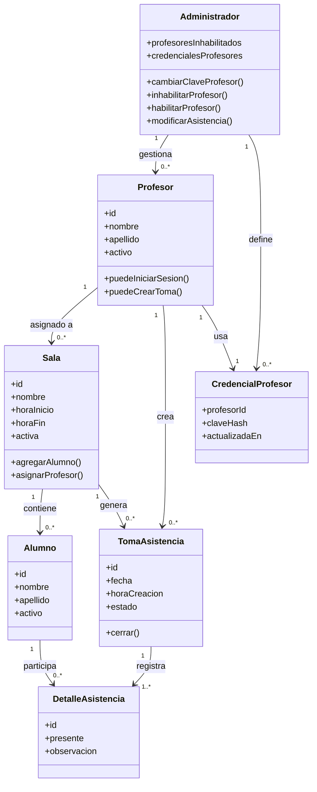

# Diagrama De Clases

## Objetivo

Este documento describe la estructura principal del sistema desde el punto de vista de diseno.

Complementa:

- `../analisis/analisis.md`
- `../analisis/especificacion.md`
- `diseno-claves.md`

## Diagrama

## Criterios De Diseno

- `Administrador` se modela como rol operativo y no como usuario persistido obligatorio, porque su clave vive fuera de la base de datos.
- `Profesor` puede estar asignado a varias salas, tal como ya fue definido en el analisis y en Alloy.
- `Alumno` pertenece a una unica sala en la primera etapa.
- `TomaAsistencia` representa la cabecera de una asistencia por sala y fecha.
- `DetalleAsistencia` baja a nivel logico una necesidad de persistencia: aunque Alloy usa conjunto de presentes, en base de datos conviene registrar una fila por alumno incluido en la toma.
- `CredencialProfesor` separa la identidad del profesor del secreto almacenado.

## Observaciones

- `DetalleAsistencia` es una decision de diseno de persistencia y no contradice el modelo conceptual.
- `estado` en `TomaAsistencia` permite contemplar evolucion futura como borrador, cerrada o corregida, aunque en la primera etapa puede usarse solo `cerrada`.
