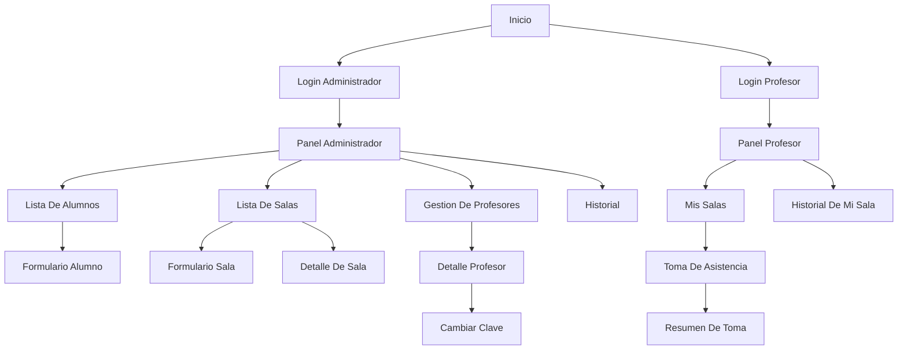

# Diseno De Pantallas Y Navegacion

## Objetivo

Definir las vistas principales del sistema y la forma en que el usuario navega entre ellas.

## Mapa De Navegacion

## Pantallas Principales

### 1. Login Administrador

- ingreso de clave unica de administrador;
- validacion contra variable de entorno;
- acceso a panel de administracion.

### 2. Login Profesor

- ingreso de identificador de profesor;
- ingreso de clave;
- bloqueo si el profesor esta inhabilitado.

### 3. Panel Administrador

- acceso rapido a salas, profesores e historial;
- resumen simple con acciones frecuentes;
- entrada principal para operaciones de gestion.

### 4. Lista De Alumnos

- buscador por nombre y apellido;
- listado de alumnos con su sala;
- accion para crear o editar alumno.

### 5. Formulario Alumno

- nombre;
- apellido;
- sala asignada;
- estado activo o inactivo si se desea manejar baja logica.

### 6. Lista De Salas

- nombre de sala;
- profesor asignado;
- horario;
- acceso a detalle o edicion.

### 7. Formulario Sala

- nombre de sala;
- profesor asignado;
- hora de inicio;
- hora de fin.

### 8. Gestion De Profesores

- listado de profesores;
- estado habilitado o inhabilitado;
- detalle de salas asignadas;
- accion para cambiar clave.

### 9. Cambiar Clave

- ingreso de nueva clave;
- confirmacion;
- sin visualizacion de la clave actual.

### 10. Mis Salas

- vista para profesor con solo las salas que tiene asignadas;
- acceso a iniciar toma o consultar historial.

### 11. Toma De Asistencia

- seleccion de sala si el profesor tiene varias;
- fecha actual;
- listado de alumnos de la sala;
- marcado de presentes;
- guardado de la toma.

### 12. Resumen De Toma

- confirmacion de presentes registrados;
- total de presentes y ausentes;
- acceso a historial.

### 13. Historial

- filtro por sala y fecha;
- consulta de tomas anteriores;
- posibilidad de correccion solo para administrador.

## Reglas De Navegacion

- El administrador accede a todas las pantallas de gestion.
- El profesor solo ve sus propias salas y tomas.
- La pantalla de cambio de clave solo aparece dentro de gestion de profesores.
- La pantalla de toma no debe abrirse si el profesor esta fuera del horario permitido.

## Relacion Con Mockups

- Los mockups actuales de `mockups/` representan la base visual de `Panel Administrador`, `Gestion De Profesores` y `Toma De Asistencia`.
- Este documento extiende esos mockups con el flujo completo de navegacion.
